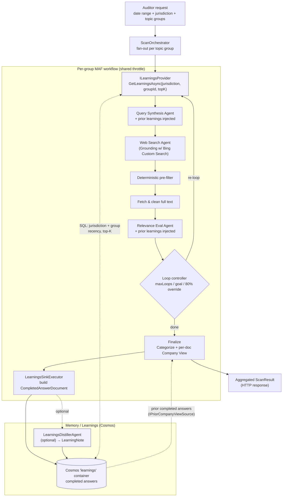

# Epic 11 — Memory / Learnings Store (Cosmos-backed) · High-Level Design

> **Status:** Draft for review (design only — no code changes)
> **Phase / Epic:** `phase-11` · Epic 11 — Memory / learnings store · Lanes **L3 + L2**
> **Companions:** `docs/backlog.md` (Epic 11), `docs/architecture-context.md` (§3, memory note),
> `docs/horizon-scanner-architecture.md` (Memory/Learnings), `docs/implementation-plan.md`.

---

## 1. Intent & the key decision

Epic 11 gives the scanner a **long-term memory**: knowledge from *prior completed runs* is retrieved
and injected into the agentic flow so later scans search smarter, judge more consistently, and — the
core requirement — **write final answers steered by prior final answers**. Learnings reach the
**final answer through three channels**:

1. **Query Synthesis** — better-targeted queries → better candidates.
2. **Relevance Eval** — steadier, prior-consistent verdicts → a better set of carried items.
3. **Company View / Finalize (the final answer itself)** — the agent that writes each per-doc Company
   View is steered by **prior completed answers** for the same jurisdiction, via the existing
   `IPriorCompanyViewSource` seam now backed by the Cosmos completed-answer store.

This is **human-in-the-loop feedback via retrieval**, not fine-tuning, and it is **distinct from the
per-run `SearchHistory`** (which is transient and lives only for the duration of one workflow).

### Decision: back the store with **Cosmos DB**, seeded from the **final response** — no Azure AI Search

The backlog originally *leaned* toward Azure AI Search to keep learnings separate from result docs.
**Azure AI Search is not needed.** This design instead **persists the final per-group response to
Cosmos** (something the pipeline does **not** do today — `TopicGroupResult` is serialized straight into
the HTTP response) and retrieves those **completed answers with a plain Cosmos SQL query**, injected
into the prompt.

Why Cosmos rather than an Azure AI Search service:

- **Already in the stack** — Cosmos backs MAF checkpointing (`checkpoints`) and the RegDocs
  vocabulary (`RegDocs`); one keyless account, one RBAC model, one SDK (`Microsoft.Azure.Cosmos`).
- **The final response is the asset** — "completed answers" (vetted items + per-doc Company View)
  are exactly what we want to recall. Persisting them once gives us **both** an audit/history store
  **and** the learnings corpus.
- **Retrieval is exact-key, not semantic** — learnings are always scoped to `jurisdiction + groupId`,
  which is a partition-scoped SQL filter. A `WHERE` + recency-ordered **top-K** query returns the
  right prior answers with **no embeddings, no vector index, and no separate search service**.

> **Vector/hybrid is optional, later.** If fuzzy or cross-group recall is ever wanted, Cosmos DB NoSQL
> can add vector indexing (DiskANN) + hybrid (BM25 + vector) behind the same `ILearningsProvider` seam
> — still no Azure AI Search. Everything below defaults to the plain SQL path.

> Separation is preserved logically via a **dedicated container** (`learnings`), not a separate
> service. `ILearningsStore` is an abstraction, so the backing store remains swappable if ever needed.

---

## 2. Where it plugs into the existing pipeline

```
                    ┌──────────────────────── existing per-group MAF workflow ─────────────────────────┐
 Auditor request →  │  QuerySynthesis → WebSearch → Pre-filter → Fetch/Clean → RelevanceEval → Loop    │
                    │        ▲                                        ▲                                  │
   (READ path)      │        │ inject distilled learnings             │ inject distilled learnings       │
                    │        └──────────────┬─────────────────────────┘                                  │
                    │                        │                                                            │
                    │                   ILearningsProvider  ← retrieve (jurisdiction + group, top-K)      │
                    │                                                                                     │
                    │  ...Finalize (Categorize + Company View) → TopicGroupResult ──┐  (WRITE path)       │
                    └──────────────────────────────────────────────────────────────┼──────────────────  ┘
                                                                                    ▼
                                              LearningsSinkExecutor → ILearningsStore.PersistAsync
                                                                                    ▼
                                              Cosmos  `learnings` container  (completed answers)
```

- **Write path (new):** after `FinalizeExecutor` produces the group's `TopicGroupResult`, a new
  terminal step persists the **completed answer** to Cosmos. This is the "save the final response"
  capability the epic hinges on.
- **Read path (new):** at the start of a run (and on each re-loop), `ILearningsProvider` retrieves
  distilled learnings scoped to `jurisdiction + topic group`, and the Query Synthesis + Relevance Eval
  prompts inject them.
- **Final-answer path (new):** at Finalize, `IPriorCompanyViewSource` — now backed by the Cosmos
  completed-answer store instead of only the historical CSV — returns prior completed answers for the
  jurisdiction that steer the **Company View** the workflow writes. This is the channel that puts
  learnings **directly into the final answer**.

All three paths are **feature-flagged** (`Learnings:Enabled`) so the pipeline runs unchanged when off.

---

## 3. Components

### 3.1 Persistence (WRITE) — "save the final response to Cosmos"

| Component | Project | Responsibility |
| --- | --- | --- |
| `CompletedAnswerDocument` | `…Core/Contracts` | Cosmos document (implements `ICosmosEntity`) wrapping the final per-group answer + retrieval metadata. |
| `ILearningsStore` | `…Workflows/Learnings` (seam) | `PersistAsync(CompletedAnswerDocument)` + `RetrieveAsync(jurisdiction, groupId, topK)`. Defined in Workflows, implemented in the API host — mirrors `IFullTextStore` / `IPriorCompanyViewSource`. |
| `CosmosLearningsStore` | `…Api/Services` | Implementation over `Microsoft.Azure.Cosmos` on the `learnings` container, keyless via `DefaultAzureCredential`. Reuses the `CosmosRepository<T>` pattern. |
| `LearningsSinkExecutor` | `…Workflows/Executors` | Terminal MAF executor: maps `TopicGroupResult` → `CompletedAnswerDocument`, calls `PersistAsync`. Idempotent on `(RunId, GroupId)`. |
| `IEmbeddingService` *(optional, Phase 2)* | `…Workflows` seam / `…Api/Services` | Only needed **if** vector/hybrid retrieval is added later. Produces embeddings from a Foundry embedding deployment. Not required for the default SQL path. |

### 3.2 Distillation (optional, quality) — raw answers → compact rules

| Component | Project | Responsibility |
| --- | --- | --- |
| `LearningsDistillerAgent` | `…Workflows/Agents` | MAF agent (over the Foundry model deployment) that condenses a completed answer (+ any captured reviewer feedback) into a few **compact guidance rules** (e.g. "for NIC, always check `legislation.gov.uk` for SI numbers"). Keeps prompts small and avoids contradictory/stale bloat. |
| `LearningNote` | `…Core/Contracts` | The distilled unit: `Jurisdiction`, `GroupId`, `Rule`, `ReasonCode`, `SourceRunId`, `CreatedAtUtc`. Stored alongside (or instead of) the raw answer in `learnings`. |

> **Phased:** ship 11.1/11.2 storing + retrieving **completed answers** directly first; add the
> distiller as a follow-up if raw answers prove too noisy in the prompt.

### 3.3 Retrieval (READ) — inject into agents

| Component | Project | Responsibility |
| --- | --- | --- |
| `ILearningsProvider` | `…Workflows/Learnings` | `GetLearningsAsync(jurisdiction, groupId, topK)` → ordered `IReadOnlyList<LearningNote>`; **plain Cosmos SQL** filter on `jurisdiction + groupId`, recency-ordered, top-K; returns empty when disabled/none. |
| `CosmosLearningsProvider` | `…Api/Services` | Runs the partition-scoped SQL query (`WHERE jurisdiction=@j AND groupId=@g ORDER BY completedAtUtc DESC OFFSET 0 LIMIT @k`) and returns the top-K most recent learnings. No embeddings. |
| Prompt injection | `…Workflows/Prompts` | New optional **"Prior learnings"** section in `QuerySynthesisPrompt` and `RelevanceEvalPrompt`, version-locked (bump both `Version`s). Rendered only when learnings are present; kept clearly separate from the per-run `SearchHistory` / reviewer-notes block. |

### 3.4 Final-answer steering (READ) — learnings into the Company View

| Component | Project | Responsibility |
| --- | --- | --- |
| `CosmosPriorCompanyViewSource` | `…Api/Services` | New production implementation of the **existing** `IPriorCompanyViewSource` seam that `FinalizeExecutor` already consumes. Reads prior **completed answers** for the jurisdiction from the `learnings` container and returns them as `CompanyViewRecord` exemplars — so each new Company View (the final answer) is steered by prior final answers. Replaces / augments `CsvPriorCompanyViewSource` (the deferred "production source keyed by jurisdiction"). |
| `FinalizeExecutor` (unchanged seam) | `…Workflows/Executors` | Already calls `IPriorCompanyViewSource.GetByJurisdictionAsync(jurisdiction)`; no code change beyond the DI swap — the completed-answer store transparently supplies richer, self-populating exemplars. |

> This channel reuses an existing seam, so **learnings reach the final answer with no new wiring in
> the workflow** — only a DI registration swap and the Cosmos-backed source.

### 3.5 Configuration, infra & security

| Component | Responsibility |
| --- | --- |
| `LearningsOptions` | `Enabled`, `TopK` (default 5), `RecencyWindowDays`, `Distill` (on/off). `ValidateDataAnnotations()` + `ValidateOnStart()`. |
| `CosmosOptions.LearningsContainer` | New container name (default `learnings`), sibling to `CheckpointsContainer` / `RegDocsContainer`. |
| `infra/modules/cosmos.bicep` | Add the `learnings` container; partition key `/jurisdiction`. (Vector embedding policy + DiskANN index only if the optional Phase-2 vector path is adopted.) |
| RBAC | `azd-postprovision-rbac` already grants the app the Cosmos data-plane role; the new container is covered. No Azure AI Search resource or role is needed. |

---

## 4. Data model (Cosmos `learnings` container)

- **Partition key:** `/jurisdiction` (retrieval is always scoped by jurisdiction; keeps hot
  partitions balanced across UK/other jurisdictions).
- **Item id:** `{runId}:{groupId}` for completed answers (idempotent write); `{runId}:{groupId}:{n}`
  for distilled notes.

```jsonc
{
  "id": "b1f0…:payroll-withholding",
  "docType": "CompletedAnswer",        // or "LearningNote"
  "jurisdiction": "United Kingdom",     // partition key
  "groupId": "payroll-withholding",
  "groupName": "Payroll Withholding",
  "dateRange": "2026-01-01..2026-06-30",
  "runId": "b1f0…",
  "completedAtUtc": "2026-07-28T10:15:00Z",
  "loopCount": 2,
  "items": [ /* final ResultItem[] incl. per-doc CompanyViewRecord */ ],
  "retrievalText": "Payroll Withholding — NIC, PAYE, ITEPA 2003 …",  // summary text used in the prompt block
  "version": 1,
  "ttl": -1                              // optional retention policy
}
```

The `items` payload is the **existing** `TopicGroupResult.Items` (each `ResultItem` already carries
its per-doc `CompanyViewRecord`), so persistence is a straight map with no new content modeling.
(An optional `embedding` field can be added later **only if** the Phase-2 vector path is adopted.)

---

## 5. End-to-end sequence (Mermaid)



---

## 6. Retrieval semantics

- **Scope:** filter `WHERE jurisdiction = @j AND groupId = @g` (partition-scoped read on
  `/jurisdiction`), matching the reference `SELECT … WHERE jurisdiction/topic group`.
- **Ranking:** **recency-ordered top-K** (`ORDER BY completedAtUtc DESC`, `LIMIT TopK`, default 5),
  optionally bounded by a `RecencyWindowDays` cutoff. No embeddings or similarity scoring in the
  default path.
- **Injection:** rendered into a bounded "Prior learnings" section — a short bulleted list of
  distilled rules (or trimmed prior summaries), explicitly labelled as *guidance from earlier runs*,
  kept **separate** from the current run's `SearchHistory`/reviewer notes so the agent doesn't
  conflate transient and long-term memory.
- **Guardrails:** cap the number/length of injected learnings to avoid prompt bloat; prefer distilled
  `LearningNote`s over raw answers; drop stale guidance via the recency window.

### 6.1 How learnings shape future answers (summary)

Learnings only ever influence a future run **through the prompts of two agents** — they are context,
never a bypass of the pipeline. Every retrieved item still goes through the full search → fetch →
eval loop before it can appear in an answer.

1. **Capture** — when a run finishes, `LearningsSinkExecutor` persists that group's completed answer
   (vetted items + per-doc Company View) to the Cosmos `learnings` container, keyed by
   `jurisdiction + groupId`.
2. **Recall** — at the start of the *next* run for the same `jurisdiction + groupId` (and on each
   re-loop), `ILearningsProvider` reads that partition and returns the top-K most recent learnings.
3. **Inject** — those learnings are rendered into a bounded **"Prior learnings"** block, kept separate
   from the current run's `SearchHistory`, and added to:
   - **Query Synthesis** — to steer queries toward sources/facets that proved fruitful before and away
     from ones that didn't, so early passes start smarter.
   - **Relevance Eval** — to judge candidates more consistently with prior verdicts (e.g. known
     authoritative sources, recurring false positives).
   - **Company View / Finalize (the final answer)** — prior completed answers for the jurisdiction are
     supplied to the Company View agent through `IPriorCompanyViewSource`, so the wording, framing, and
     house style of each new final answer follows earlier ones.
4. **Effect** — the agents produce better-targeted queries, steadier verdicts, **and final answers
   consistent with prior ones**, but the **retrieved evidence itself is always re-verified** by the
   loop. Learnings guide the search and the write-up; they never replace the evidence.

Net: each completed run makes the *next* scan of the same jurisdiction+group a little sharper **and its
final answer more consistent**, without ever short-circuiting grounding or the three-verdict eval.

### 6.2 How injection works (mechanism)

"Injection" means the learnings text is **concatenated into the agent's prompt as an extra labelled
section** before the LLM call — the exact mechanism the pipeline already uses for `SearchHistory` /
reviewer notes. There is **no special API and nothing is added to the retrieval results**; it is
string composition in the prompt builders.

1. **Retrieve** — the executor calls `ILearningsProvider.GetLearningsAsync(jurisdiction, groupId,
   topK)` and gets back a small ordered list of `LearningNote`s (or trimmed prior summaries).
2. **Format** — those notes are rendered into a short, explicitly labelled block, e.g.:

   ```
   Prior learnings (guidance from earlier completed runs — context only, verify everything):
   - For NIC, legislation.gov.uk SI pages are authoritative; prefer them over commentary.
   - gov.uk "policy paper" pages for this theme are usually announcements, not in-force rules — treat as BORDERLINE.
   ```

3. **Append to the prompt** — the block is passed as a **new parameter** into the existing prompt
   builders and inserted as its own heading, exactly like the current `"Reviewer notes from earlier
   passes"` / `"Queries already tried"` sections:

   ```csharp
   QuerySynthesisPrompt.BuildUserPrompt(topicGroup, searchHistory, priorLearnings)
   RelevanceEvalPrompt.BuildUserPrompt(fullText, dates, searchHistory, priorLearnings)
   ```

   The builder emits the "Prior learnings" section **only when the list is non-empty**, and keeps it
   **visually separate** from `SearchHistory` so the model does not conflate long-term memory with the
   current run's transient state.
4. **Version-lock** — because the prompt text changes, bump `QuerySynthesisPrompt.Version` and
   `RelevanceEvalPrompt.Version` **together** (they are already version-locked) so eval runs attribute
   output shifts to the added learnings.

The LLM simply *reads* the learnings as additional context in its prompt — it influences how it writes
queries and assigns verdicts, but the block never enters the retrieval results or bypasses the loop.

---

## 7. Mapping to backlog stories

| Story | Covered by |
| --- | --- |
| **11.1** `IAzureSearchService` for curated learnings — *superseded by* `ILearningsStore` (Cosmos SQL; **no Azure AI Search**) | §3.1, §4 — `ILearningsStore` + `CosmosLearningsStore` + `learnings` container; keyless `DefaultAzureCredential`; plain SQL retrieval. |
| **11.2** Feed retrieved learnings into synthesis + eval (scoped to jurisdiction + group, top-K + recency; distinct from `SearchHistory`) | §3.3, §6 — `ILearningsProvider` + prompt injection in `QuerySynthesisPrompt` / `RelevanceEvalPrompt`. |
| **Learnings into final answers** (the stated requirement) | §1, §3.4, §5, §6.1 — `CosmosPriorCompanyViewSource` feeds prior completed answers into the Company View via the existing `IPriorCompanyViewSource` seam `FinalizeExecutor` already uses. |
| Epic demo — prior-run learnings retrieved and demonstrably influence queries/eval **and the final Company View** | §5 sequence; enable flag on, run twice, show the second run's queries/eval shift **and its Company View following prior answers**. |

> **Decision (confirmed):** Epic 11 does **not** use Azure AI Search. Learnings are stored in and
> retrieved from **Cosmos** via a plain SQL query and injected into the prompts. Vector/hybrid remains
> an optional future enhancement behind the same seam.

---

## 8. Risks & open questions

- **Reviewer-feedback capture** — the richest learnings come from the "hybrid structured review form"
  (verdict correction + reason codes + note) described in `horizon-scanner-architecture.md`. That
  capture UI is out of scope here; until it exists, learnings are distilled from the **completed
  answers only**. Confirm scope.
- **Retention / drift** — set a `ttl` / recency window so stale guidance ages out; avoid letting an
  early wrong answer poison future runs (mitigated by the recency window + distiller).
- **Idempotency** — writes keyed on `(RunId, GroupId)` so re-runs/resumes upsert rather than duplicate.
- **Separation of concerns** — keep the audit/history use of completed answers and the learnings
  retrieval use in the **same** container but distinguished by `docType`, or split into two containers?
  (Recommend one container + `docType` to start.)
```