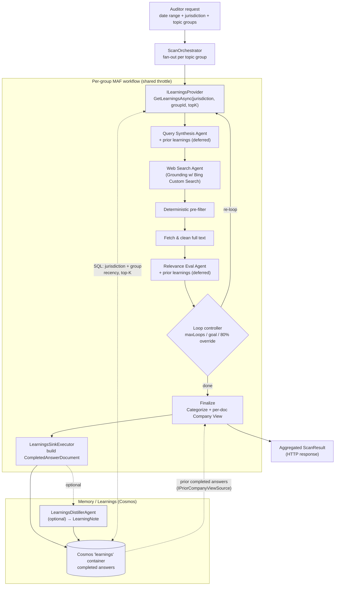

# Epic 11 — Memory / Learnings Store (Cosmos-backed) · High-Level Design

> **Status:** Draft for review (design only — no code changes)
> **Phase / Epic:** `phase-11` · Epic 11 — Memory / learnings store · Lanes **L3 + L2**
> **Companions:** `docs/backlog.md` (Epic 11), `docs/architecture-context.md` (§3, memory note),
> `docs/horizon-scanner-architecture.md` (Memory/Learnings), `docs/implementation-plan.md`.

---

## 1. Intent & the key decision

Epic 11 gives the scanner a **long-term memory**: knowledge from *prior completed runs* is retrieved
and injected into the agentic flow so later scans search smarter, judge more consistently, and — the
core requirement — **write final answers steered by prior final answers**. Learnings reach the
**final answer primarily through the Company View / Finalize channel**. Two further channels are
**deferred** and gated on a proven, approved corrective feedback signal (see §3.3):

1. **Company View / Finalize (the final answer itself) — PRIMARY, ships first.** The agent that writes
   each per-doc Company View is steered by prior **approved** completed answers for the same
   `jurisdiction + topic group`, via the existing `IPriorCompanyViewSource` seam backed by the Cosmos
   completed-answer store.
2. **Query Synthesis — DEFERRED (Phase 2).** Validate/test only *after* the Finalize channel is in place.
3. **Relevance Eval — DEFERRED, possibly never.** See §3.3 for the correctness risk.

This is **human-in-the-loop feedback via retrieval**, not fine-tuning, and it is **distinct from the
per-run `SearchHistory`** (which is transient and lives only for the duration of one workflow).

> **Prerequisite (hard dependency):** Epic 11 depends on the **reviewer feedback form + approval
> workflow** (§3.6). Learnings are seeded **only from reviewer-approved feedback**, never from
> unreviewed prior outputs — otherwise the store is a self-reinforcing **echo chamber** and must stay
> disabled.

### Decision: back the store with **Cosmos DB**, seeded from the **final response** — no Azure AI Search

The backlog originally *leaned* toward Azure AI Search to keep learnings separate from result docs.
**Azure AI Search is not needed.** This design instead **persists the final per-group response to
Cosmos** (something the pipeline does **not** do today — `TopicGroupResult` is serialized straight into
the HTTP response) and retrieves those **completed answers with a plain Cosmos SQL query**, injected
into the prompt.

Why Cosmos rather than an Azure AI Search service:

- **Already in the stack** — Cosmos backs MAF checkpointing (`checkpoints`) and the RegDocs
  vocabulary (`RegDocs`); one keyless account, one RBAC model, one SDK (`Microsoft.Azure.Cosmos`).
- **The final response is the asset** — "completed answers" (vetted items + per-doc Company View)
  are exactly what we want to recall. Persisting them once gives us **both** an audit/history store
  **and** the learnings corpus.
- **Retrieval is exact-key, not semantic** — learnings are always scoped to `jurisdiction + groupId`,
  which is a partition-scoped SQL filter. A `WHERE` + recency-ordered **top-K** query returns the
  right prior answers with **no embeddings, no vector index, and no separate search service**.

> **Vector/hybrid is optional, later.** If fuzzy or cross-group recall is ever wanted, Cosmos DB NoSQL
> can add vector indexing (DiskANN) + hybrid (BM25 + vector) behind the same `ILearningsProvider` seam
> — still no Azure AI Search. Everything below defaults to the plain SQL path.

> Separation is preserved logically via a **dedicated container** (`learnings`), not a separate
> service. `ILearningsStore` is an abstraction, so the backing store remains swappable if ever needed.

---

## 2. Where it plugs into the existing pipeline

```
                    ┌──────────────────────── existing per-group MAF workflow ─────────────────────────┐
 Auditor request →  │  QuerySynthesis → WebSearch → Pre-filter → Fetch/Clean → RelevanceEval → Loop    │
                    │        ▲                                        ▲                                  │
   (READ path)      │        │ inject distilled learnings             │ inject distilled learnings       │
                    │        └──────────────┬─────────────────────────┘                                  │
                    │                        │                                                            │
                    │                   ILearningsProvider  ← retrieve (jurisdiction + group, top-K)      │
                    │                                                                                     │
                    │  ...Finalize (Categorize + Company View) → TopicGroupResult ──┐  (WRITE path)       │
                    └──────────────────────────────────────────────────────────────┼──────────────────  ┘
                                                                                    ▼
                                              LearningsSinkExecutor → ILearningsStore.PersistAsync
                                                                                    ▼
                                              Cosmos  `learnings` container  (completed answers)
```

- **Write path (new):** after `FinalizeExecutor` produces the group's `TopicGroupResult`, a new
  terminal step persists the **completed answer** to Cosmos. This is the "save the final response"
  capability the epic hinges on.
- **Read path (new):** the only READ path that ships first is `IPriorCompanyViewSource` → Finalize
  (the Final-answer path below). The `ILearningsProvider` → Query Synthesis / Relevance Eval injection
  is **deferred (Phase 2)** — QS validated after Finalize, RE possibly never (§3.3).
- **Final-answer path (new):** at Finalize, `IPriorCompanyViewSource` — now backed by the Cosmos
  completed-answer store instead of only the historical CSV — returns prior **approved** completed
  answers scoped to **`jurisdiction + topic group`** that steer the **Company View** the workflow
  writes. This is the channel that puts learnings **directly into the final answer**, and it ships first.

All paths are **feature-flagged** (master `Learnings:Enabled`, plus per-channel `CompanyViewEnabled` /
`QuerySynthesisEnabled` / `RelevanceEvalEnabled`) so the pipeline runs unchanged when off, and the
deferred channels stay off by default.

---

## 3. Components

### 3.1 Persistence (WRITE) — "save the final response to Cosmos"

| Component | Project | Responsibility |
| --- | --- | --- |
| `CompletedAnswerDocument` | `…Core/Contracts` | Cosmos document (implements `ICosmosEntity`) wrapping the final per-group answer + retrieval metadata. |
| `ILearningsStore` | `…Workflows/Learnings` (seam) | `PersistAsync(CompletedAnswerDocument)` + `RetrieveAsync(jurisdiction, groupId, topK)`. Defined in Workflows, implemented in the API host — mirrors `IFullTextStore` / `IPriorCompanyViewSource`. |
| `CosmosLearningsStore` | `…Api/Services` | Implementation over `Microsoft.Azure.Cosmos` on the `learnings` container, keyless via `DefaultAzureCredential`. Reuses the `CosmosRepository<T>` pattern. |
| `LearningsSinkExecutor` | `…Workflows/Executors` | Terminal MAF executor: maps `TopicGroupResult` → `CompletedAnswerDocument`, calls `PersistAsync`. Idempotent on `(RunId, GroupId)`. |
| `IEmbeddingService` *(optional, Phase 2)* | `…Workflows` seam / `…Api/Services` | Only needed **if** vector/hybrid retrieval is added later. Produces embeddings from a Foundry embedding deployment. Not required for the default SQL path. |

### 3.2 Distillation (optional, quality) — raw answers → compact rules

| Component | Project | Responsibility |
| --- | --- | --- |
| `LearningsDistillerAgent` | `…Workflows/Agents` | MAF agent (over the Foundry model deployment) that condenses a completed answer (+ any captured reviewer feedback) into a few **compact guidance rules** (e.g. "for NIC, always check `legislation.gov.uk` for SI numbers"). Keeps prompts small and avoids contradictory/stale bloat. |
| `LearningNote` | `…Core/Contracts` | The distilled unit: `Jurisdiction`, `GroupId`, `Rule`, `ReasonCode`, `SourceRunId`, `CreatedAtUtc`. Stored alongside (or instead of) the raw answer in `learnings`. |

> **Phased:** ship 11.1/11.2 storing + retrieving **completed answers** directly first; add the
> distiller as a follow-up if raw answers prove too noisy in the prompt.

### 3.3 Retrieval (READ) — inject into agents

> **Deferred (Phase 2).** This whole section — `ILearningsProvider` + prompt injection into Query
> Synthesis and Relevance Eval — is **not** in the first release. **Relevance Eval injection is
> deferred, possibly permanently:** "prior-consistent verdicts" conflates *consistency* with
> *correctness* — a standing rule ("treat gov.uk policy papers as BORDERLINE") will mis-judge a policy
> paper that genuinely **is** in-force this time. **Query Synthesis injection** is lower risk but still
> Phase 2: ship and validate the Company View channel (§3.4) first, then A/B QS behind its own flag. If
> RE is ever revisited, feed it only **structured** signals (authoritative-source / false-positive host
> lists), never free-form guidance.

| Component | Project | Responsibility |
| --- | --- | --- |
| `ILearningsProvider` | `…Workflows/Learnings` | `GetLearningsAsync(jurisdiction, groupId, topK)` → ordered `IReadOnlyList<LearningNote>`; **plain Cosmos SQL** filter on `jurisdiction + groupId`, recency-ordered, top-K; returns empty when disabled/none. |
| `CosmosLearningsProvider` | `…Api/Services` | Runs the partition-scoped SQL query (`WHERE jurisdiction=@j AND groupId=@g ORDER BY completedAtUtc DESC OFFSET 0 LIMIT @k`) and returns the top-K most recent learnings. No embeddings. |
| Prompt injection | `…Workflows/Prompts` | New optional **"Prior learnings"** section in `QuerySynthesisPrompt` and `RelevanceEvalPrompt`, version-locked (bump both `Version`s). Rendered only when learnings are present; kept clearly separate from the per-run `SearchHistory` / reviewer-notes block. |

### 3.4 Final-answer steering (READ) — learnings into the Company View

| Component | Project | Responsibility |
| --- | --- | --- |
| `CosmosPriorCompanyViewSource` | `…Api/Services` | New production implementation of the `IPriorCompanyViewSource` seam that `FinalizeExecutor` consumes. Reads prior **reviewer-approved** completed answers scoped to **`jurisdiction + topic group`** from the `learnings` container and returns them as `CompanyViewRecord` exemplars — so each new Company View (the final answer) is steered by relevant, approved prior answers. Replaces / augments `CsvPriorCompanyViewSource`. |
| `FinalizeExecutor` (small seam change) | `…Workflows/Executors` | The existing `GetByJurisdictionAsync(jurisdiction)` is **jurisdiction-only** and cannot express the `+ topic group` scope above — extend the seam (e.g. `GetByJurisdictionAndGroupAsync(jurisdiction, groupId)`) or pass the group from context. So this channel is a **small seam change, not a pure DI swap.** |

> This channel reuses an existing seam, so **learnings reach the final answer with minimal new wiring in
> the workflow** — a small extension of `IPriorCompanyViewSource` (to accept the topic group), a DI
> registration swap, and the Cosmos-backed source. **Exemplar scope decision:** default
> **`jurisdiction + topic group`** for relevance; the customer should confirm this vs jurisdiction-wide
> "house style" (configurable via `ExemplarScope`, §3.5).

### 3.5 Configuration, infra & security

| Component | Responsibility |
| --- | --- |
| `LearningsOptions` | `Enabled` (master), `CompanyViewEnabled` (default true), `QuerySynthesisEnabled` (default false — Phase 2), `RelevanceEvalEnabled` (default false — deferred), `TopK` (default 5, the **only** recency control), `ExemplarScope` (`JurisdictionAndGroup` default \| `Jurisdiction`), `RequireApproved` (default true), `Distill` (on/off). `ValidateDataAnnotations()` + `ValidateOnStart()`. |
| `CosmosOptions.LearningsContainer` | New container name (default `learnings`), sibling to `CheckpointsContainer` / `RegDocsContainer`. |
| `infra/modules/cosmos.bicep` | Add the `learnings` container; partition key `/jurisdiction` (**reconsider for scale — §8**). (Vector embedding policy + DiskANN index only if the optional Phase-2 vector path is adopted.) |
| RBAC | `azd-postprovision-rbac` already grants the app the Cosmos data-plane role; the new container is covered. No Azure AI Search resource or role is needed. |

### 3.6 Reviewer feedback capture & approval (prerequisite)

The corrective signal that makes learnings worth using. **Blocks the rest of Epic 11** — until approved
feedback exists, the store must stay disabled.

| Component | Responsibility |
| --- | --- |
| Feedback form | Shown after a Company View is generated. Captures a **minimal structured signal** (approve/reject or 1–5 rating) **plus** free-form corrective text ("what's wrong / should change"). Keep both — free text carries the richness, the structured bit makes learnings filterable/weightable. |
| Approval workflow (admin) | An admin section where someone reviews submitted feedback and **approves** it. **Only approved feedback/answers are eligible to be retrieved as learnings** (`RequireApproved`). |
| Persisted fields | On the learning document: `reviewStatus` (`Pending`/`Approved`/`Rejected`), `reviewer`, `reviewedAtUtc`, `rating`, `reasonCodes[]`, `feedbackText`. Retrieval filters `reviewStatus = 'Approved'`. |

---

## 4. Data model (Cosmos `learnings` container)

- **Partition key:** `/jurisdiction` today, but **reconsider for scale (OPEN, §8):** with a UK-heavy
  workload and keep-all retention (`ttl: -1`) this is effectively a *single* hot logical partition
  heading toward the 20 GB cap. Since retrieval is `jurisdiction + groupId`, prefer a composite/synthetic
  key (e.g. `jurisdiction|groupId`).
- **Item id:** `{runId}:{groupId}` for completed answers (idempotent write); `{runId}:{groupId}:{n}`
  for distilled notes.

```jsonc
{
  "id": "b1f0…:payroll-withholding",
  "docType": "CompletedAnswer",        // or "LearningNote"
  "jurisdiction": "United Kingdom",     // partition key
  "groupId": "payroll-withholding",
  "groupName": "Payroll Withholding",
  "dateRange": "2026-01-01..2026-06-30",
  "runId": "b1f0…",
  "completedAtUtc": "2026-07-28T10:15:00Z",
  "loopCount": 2,
  "reviewStatus": "Approved",            // Pending | Approved | Rejected — only Approved is retrieved
  "reviewer": "jsmith",
  "reviewedAtUtc": "2026-07-29T09:00:00Z",
  "rating": 4,
  "reasonCodes": ["house-style-ok", "source-authoritative"],
  "feedbackText": "Tighten the NIC wording; cite the SI number.",
  "items": [ /* final ResultItem[] incl. per-doc CompanyViewRecord */ ],
  "retrievalText": "Payroll Withholding — NIC, PAYE, ITEPA 2003 …",  // summary text used in the prompt block
  "version": 1,
  "ttl": -1                              // keep all; recency is controlled solely by TopK at query time
}
```

The `items` payload is the **existing** `TopicGroupResult.Items` (each `ResultItem` already carries
its per-doc `CompanyViewRecord`), so persistence is a straight map with no new content modeling.
(An optional `embedding` field can be added later **only if** the Phase-2 vector path is adopted.)

---

## 5. End-to-end sequence (Mermaid)



---

## 6. Retrieval semantics

- **Scope:** filter `WHERE jurisdiction = @j AND groupId = @g AND reviewStatus = 'Approved'`
  (partition-scoped read), matching the reference `SELECT … WHERE jurisdiction/topic group`.
- **Ranking:** **recency-ordered top-K only** (`ORDER BY completedAtUtc DESC`, `LIMIT TopK`, default 5),
  filtered to `reviewStatus = 'Approved'`. The store **keeps all** approved learnings; a query never
  injects more than the top-K most recent — there is **no "pull all"** and no TTL delete. `TopK` is the
  sole recency control. No embeddings or similarity scoring in the default path.
- **Injection:** rendered into a bounded "Prior learnings" section — a short bulleted list of
  distilled rules (or trimmed prior summaries), explicitly labelled as *guidance from earlier runs*,
  kept **separate** from the current run's `SearchHistory`/reviewer notes so the agent doesn't
  conflate transient and long-term memory.
- **Guardrails:** cap the number/length of injected learnings to avoid prompt bloat; prefer distilled
  `LearningNote`s over raw answers; rely on approval + top-K recency to keep guidance current.

### 6.1 How learnings shape future answers (summary)

Learnings only ever influence a future run **through agent prompts** — they are context, never a bypass
of the pipeline. In the first release this is the **Company View** prompt at Finalize; the Query
Synthesis and Relevance Eval channels are **deferred** (§3.3). Every retrieved item still goes through
the full search → fetch → eval loop before it can appear in an answer.

1. **Capture** — when a run finishes, `LearningsSinkExecutor` persists that group's completed answer
   (vetted items + per-doc Company View) to the Cosmos `learnings` container, keyed by
   `jurisdiction + groupId`.
2. **Recall** — at the start of the *next* run for the same `jurisdiction + groupId` (and on each
   re-loop), `ILearningsProvider` reads that partition and returns the top-K most recent learnings.
3. **Inject** — those learnings are rendered into a bounded **"Prior learnings"** block, kept separate
   from the current run's `SearchHistory`, and added to:
   - **Company View / Finalize (the final answer) — ships first.** Prior **approved** completed answers
     for the `jurisdiction + topic group` are supplied to the Company View agent through
     `IPriorCompanyViewSource`, so the wording, framing, and house style of each new final answer
     follows earlier approved ones.
   - **Query Synthesis (deferred, Phase 2)** — to steer queries toward sources/facets that proved
     fruitful before; validated only after the Company View channel.
   - **Relevance Eval (deferred, possibly never)** — see §3.3 for the consistency-vs-correctness risk.
4. **Effect** — the agents produce better-targeted queries, steadier verdicts, **and final answers
   consistent with prior ones**, but the **retrieved evidence itself is always re-verified** by the
   loop. Learnings guide the search and the write-up; they never replace the evidence.

Net: each completed run makes the *next* scan of the same jurisdiction+group a little sharper **and its
final answer more consistent**, without ever short-circuiting grounding or the three-verdict eval.

### 6.2 How injection works (mechanism)

> Applies to the **deferred** Query Synthesis / Relevance Eval channels (§3.3). The Company View channel
> uses the existing `IPriorCompanyViewSource` seam, not this prompt-injection path.

"Injection" means the learnings text is **concatenated into the agent's prompt as an extra labelled
section** before the LLM call — the exact mechanism the pipeline already uses for `SearchHistory` /
reviewer notes. There is **no special API and nothing is added to the retrieval results**; it is
string composition in the prompt builders.

1. **Retrieve** — the executor calls `ILearningsProvider.GetLearningsAsync(jurisdiction, groupId,
   topK)` and gets back a small ordered list of `LearningNote`s (or trimmed prior summaries).
2. **Format** — those notes are rendered into a short, explicitly labelled block, e.g.:

   ```
   Prior learnings (guidance from earlier completed runs — context only, verify everything):
   - For NIC, legislation.gov.uk SI pages are authoritative; prefer them over commentary.
   - gov.uk "policy paper" pages for this theme are usually announcements, not in-force rules — treat as BORDERLINE.
   ```

3. **Append to the prompt** — the block is passed as a **new parameter** into the existing prompt
   builders and inserted as its own heading, exactly like the current `"Reviewer notes from earlier
   passes"` / `"Queries already tried"` sections:

   ```csharp
   QuerySynthesisPrompt.BuildUserPrompt(topicGroup, searchHistory, priorLearnings)
   RelevanceEvalPrompt.BuildUserPrompt(fullText, dates, searchHistory, priorLearnings)
   ```

   The builder emits the "Prior learnings" section **only when the list is non-empty**, and keeps it
   **visually separate** from `SearchHistory` so the model does not conflate long-term memory with the
   current run's transient state.
4. **Version-lock** — because the prompt text changes, bump `QuerySynthesisPrompt.Version` and
   `RelevanceEvalPrompt.Version` **together** (they are already version-locked) so eval runs attribute
   output shifts to the added learnings.

The LLM simply *reads* the learnings as additional context in its prompt — it influences how it writes
queries and assigns verdicts, but the block never enters the retrieval results or bypasses the loop.

---

## 7. Mapping to backlog stories

| Story | Covered by |
| --- | --- |
| **Prerequisite** reviewer feedback form + approval workflow | §3.6 — capture (structured + free text), admin approval; only `reviewStatus = 'Approved'` is retrieved. **Blocks the rest of the epic.** |
| **11.1** `IAzureSearchService` for curated learnings — *superseded by* `ILearningsStore` (Cosmos SQL; **no Azure AI Search**) | §3.1, §4 — `ILearningsStore` + `CosmosLearningsStore` + `learnings` container; keyless `DefaultAzureCredential`; plain SQL retrieval. |
| **Learnings into final answers** (the stated requirement — ships first) | §1, §3.4, §5, §6.1 — `CosmosPriorCompanyViewSource` feeds prior approved completed answers (`jurisdiction + topic group`) into the Company View via `IPriorCompanyViewSource`. |
| **11.2a (deferred, Phase 2)** Feed learnings into **Query Synthesis** (validate after the Company View channel) | §3.3, §6 — `ILearningsProvider` + `QuerySynthesisPrompt` injection, own flag, A/B tested. |
| **11.2b (deferred, possibly never)** Feed learnings into **Relevance Eval** | §3.3 — held back due to the consistency-vs-correctness risk; only with structured signals if ever. |
| Epic demo — prior-run learnings retrieved and demonstrably influence queries/eval **and the final Company View** | §5 sequence; enable flag on, run twice, show the second run's queries/eval shift **and its Company View following prior answers**. |

> **Decision (confirmed):** Epic 11 does **not** use Azure AI Search. Learnings are stored in and
> retrieved from **Cosmos** via a plain SQL query and injected into the prompts. Vector/hybrid remains
> an optional future enhancement behind the same seam.

---

## 8. Risks & open questions

- **Reviewer-feedback capture** — **RESOLVED: hard prerequisite (§3.6),** not out of scope. Learnings
  are seeded **only from reviewer-approved feedback**; without it the store is an echo chamber and stays
  disabled.
- **Learning eligibility** — **RESOLVED:** only `reviewStatus = 'Approved'` answers are retrieved
  (`RequireApproved`, default true).
- **Exemplar scope** — **RESOLVED (default):** **`jurisdiction + topic group`** for relevance;
  configurable via `ExemplarScope`. Customer to confirm vs jurisdiction-wide house style.
- **QS / RE injection** — **RESOLVED:** Query Synthesis deferred to Phase 2 (validated after the Company
  View channel); Relevance Eval deferred, possibly never (§3.3).
- **Recency** — **RESOLVED:** keep all approved answers; inject only **top-K (default 5)** most recent.
  `TopK` is the sole recency control — no TTL delete / `RecencyWindowDays` cutoff.
- **Partition key** — **OPEN:** reconsider `/jurisdiction` vs composite `jurisdiction|groupId` for scale
  (§4) given keep-all retention and a UK-heavy workload.
- **Idempotency / dedup** — writes keyed on `(RunId, GroupId)` upsert rather than duplicate; note that
  re-scanning the same `jurisdiction + groupId + dateRange` can still create near-duplicate approved
  rows that dominate top-K — optionally upsert on `(jurisdiction, groupId, dateRange)`.
- **Separation of concerns** — one container + `docType` to start (agreed).
```