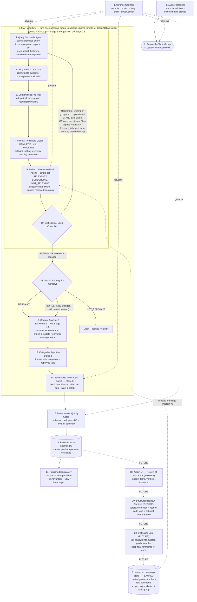

# Horizon Scanner — Revised Architecture & Workflow

> Regulatory horizon-scanning pipeline. Auditors search for regulatory updates by date +
> jurisdiction (e.g., United Kingdom). Each jurisdiction has topic groups (e.g., Payroll
> Withholding, Fringe Benefits, Expatriates); each group is a curated set of keyword/synonym
> phrases (acronyms and aliases of the same concepts) used to drive query synthesis. Built on the
> **Microsoft Agent Framework (MAF) in .NET**, with one workflow per topic group running in parallel.
>
> Topic groups and authoritative sources come from the customer (see `Topic Groups.docx`). UK
> `AuthoritativeSources`: `gov.uk/hm-revenue-customs`, `supremecourt.uk`, `legislation.gov.uk`.

## Design decisions

- **Stage 1 + Stage 1.5 merged.** A single full-text relevance eval replaces the
  summary-based eval. The Bing 2–3 sentence summary may be too lossy for a compliance use case
  where a false negative (missed regulatory update) is far costlier than a false positive.
- **Query synthesis, not fixed 4-way fan-out.** The query-rewrite agent synthesizes a focused
  query from the topic group's keyword/synonym set (the groups are dense OR-lists of acronyms
  and aliases, e.g. `"Advisory Fuel Rates" OR "AFR" OR "Company Car" OR "EV"`). The number of
  queries per pass is the agent's decision, not a hard-coded 4.
- **Iterative, history-aware loop.** Each pass appends to a per-topic-group **search history**
  held **in memory for the duration of the run** (it is *not* a queryable DB store; a read-only
  snapshot is checkpointed for resume and returned on the run result for the future UI) — e.g. a
  JSON object with arrays for `searchQueries`, `vettedResults`, `discardedResults`, etc. On a re-run,
  the query-synthesis agent uses that history to craft a *new, non-redundant* query (cover
  untested synonyms, fill gaps), and the eval agent uses it to avoid re-judging duplicates and
  to assess coverage against the goal.
- **Bing search is scoped to the primary-source domain allowlist**, so the
  allowlist gate is enforced *at query time*, not after. No open web search.
- **Deterministic pre-filter** before fetch: (optional) dedupe (including cross-topic-group) + URL
  reachability/validity. Non-LLM, keeps the eval to a single LLM call per item.
- **Full-text fetch is failure-prone**: handle HTML/PDF, strip boilerplate, and on failure
  fall back to the Bing summary and flag the item `unverified` rather than dropping it.
- **Three-verdict eval kept** (RELEVANT / BORDERLINE / NOT_RELEVANT). Fully automated —
  no human gate. BORDERLINE is stored and flagged for surfacing in the admin UI / export.
- **Agentic loop exit conditions:**
  - Hard cap: `maxLoops` setting, **tunable per topic group** (default 3). Larger groups with
    many synonyms/aliases (e.g. the Miscellaneous / IR35 group) may warrant a higher cap so the
    query-synthesis agent can rotate coverage across more passes; small groups can stay at 3 or lower.
  - Goal-satisfaction: eval agent judges the topic-group goal met (enough data gathered).
  - **Accuracy override:** if a single pass returns **≥ 80% RELEVANT**, force another pass
    even if the agent says "enough" — there may be more updates to find.
- **Memory / Learnings (PLANNED, not yet implemented):** reviewer feedback retrieved into the
  eval step. Generic "Memory/Learnings store" for now (leaning Azure AI Search to keep
  learnings separate from result docs). Human-in-the-loop *feedback via retrieval*, not fine-tuning.
- **Review capture = hybrid structured form** (not a bare freeform box):
  - verdict-correction (should-have-been RELEVANT / BORDERLINE / NOT_RELEVANT)
  - reason-code tags from a controlled vocabulary
    (e.g., `missed-effective-date`, `non-authoritative-source`, `wrong-jurisdiction`,
    `duplicate`, `out-of-scope-topic`, `summary-misled-eval`)
  - optional freeform note (preserved verbatim, never discarded)
- **Result docs → Cosmos DB**, one versioned doc per item per run (audit/review record).

## Open considerations / risks to watch

- **Cost:** full-text eval of every surviving URL × N topic groups is much more expensive than
  the old summary→full-text cascade as the bing summary may still help the LLM weed out URLs.
  The pre-filter + allowlist will help to mitigate this.
- **Shared quota contention:** N parallel MAF workflows share Azure OpenAI TPM/RPM and Bing QPS.
  Use a shared throttle/`SemaphoreSlim` across workflows.
- **Cross-topic-group dedupe:** security vs personnel groups will surface overlapping URLs;
  don't fetch/eval/store the same doc multiple times.
- **Effective-date handling:** since search is by date, publication/effective date may be a
  primary relevance + filter signal, feeding back into the eval.
- **Learnings retrieval scope:** (future planning) scope to `jurisdiction + topic group`
  (+ semantic similarity), use top-K + recency weighting, and distill raw comments into compact
  guidance rules to avoid prompt bloat and contradictory/stale guidance.

## Workflow diagram

## Step explanations

| # | Step | What it does / why |
|---|------|--------------------|
| 1 | Auditor Request | Entry point: date + jurisdiction (e.g., UK) + the topic groups to scan. |
| 2 | Fan-out by Topic Group | Spawns one MAF workflow per topic group; they run in parallel. |
| 3 | MAF Workflow (per group) | Self-contained run for one group; shares a throttle so parallel runs don't blow OpenAI TPM/RPM or Bing QPS limits. |
| 4 | Query Synthesis Agent | Builds a focused query (or a small set) from the topic group's keyword/synonym set — count is the agent's call, not a fixed 4. On re-runs, uses the run's search history to craft a new, non-redundant query that targets untested synonyms or gaps. |
| 5 | Bing Search (Azure) | Search constrained to the customer's primary-source domain allowlist (gate enforced here, not after). |
| 6 | Deterministic Pre-filter | Non-LLM: dedupe (incl. across topic groups) + URL reachability/validity, before any fetch. |
| 7 | Full-text Fetch & Clean | Fetch HTML/PDF, strip boilerplate; if fetch fails, fall back to Bing summary and flag the item "unverified" rather than dropping it. |
| 8 | Memory / Learnings store | **Planned.** Curated guidance rules (+ raw comments), scoped to jurisdiction + topic group, retrieved into the eval. |
| — | Search History (this run) | *Not shown as a separate node — it's inherent to the loop.* Per-topic-group, **in-memory only** (not a queryable DB store) for the duration of the run — e.g. a JSON object with `searchQueries[]`, `vettedResults[]`, `discardedResults[]`, appended each pass. Feeds the query-synthesis agent (avoid redundant queries) and the eval agent (coverage assessment, skip duplicates). Distinct from the planned cross-run Memory/Learnings store (#8). A read-only **snapshot** of this history is (a) checkpointed for resumability and (b) **returned on the run result / API** (`TopicGroupResult.History`) so the future Admin UI (#18) can replay each pass — query, hits, verdicts, and the loop reasoning. |
| 9 | Full-text Relevance Eval (single call) | The merged Stage 1 + 1.5 relevance decision on full text; effective-date aware; consumes injected learnings and the run's search history for coverage. One LLM eval per item. |
| 10 | Sufficiency / Loop Controller | Continue if under per-group `maxLoops` (default 3, tunable per topic group) and goal unmet; exit when satisfied — **override**: re-loop if a pass is **≥80% RELEVANT** (boundary inclusive). |
| 11 | Verdict Routing (in-memory) | Not a separate service call — just the in-memory decision of what to send on to step 12 based on each item's verdict. **RELEVANT** and **BORDERLINE** are both carried forward into enrichment; BORDERLINE items are kept but **flagged in the internal data structure** (so they're visible/auditable downstream) rather than blocking on a human. **NOT_RELEVANT** is dropped (logged for audit). |
| 12 | Content Analysis / Enrichment | Former Stage 1.5, now enrichment-only (whatItDoes, metadata) since relevance moved into the loop. |
| 13 | Categorize Agent (Stage 2) | Impact area, regulator, approved tag selection. |
| 14 | Summarize & Impact Agent (Stage 3) | RAG over history; plain-English summary; effective-date extraction. |
| 15 | Deterministic Quality Gates | Non-LLM, code-only validation before persisting: confirms each result matches the expected output **schema** (required fields present/typed), **dedupes against items already in Cosmos** (don't store the same regulatory update twice across runs), and stamps a **level-of-authority** (e.g. legislation > court ruling > HMRC guidance) derived from the source domain. Bad/duplicate records are rejected here so only clean, deduped docs reach the store. |
| 16 | Result Docs (Cosmos DB) | Saves each result item (per topic group / workflow) as its own document in Cosmos DB — one versioned doc per item per run — forming the durable record for export and the (future) review UI. |
| 17 | Published Regulatory Update | Auto-published to Reg Advantage + CSV/Excel export. |
| 18 | Admin UI — Review of Past Runs (FUTURE) | **Not in POC.** Reviewers browse prior runs and items after the fact. |
| 19 | Structured Review Capture (FUTURE) | **Not in POC.** Verdict-correction + reason-code tags + optional freeform note. |
| 20 | Distillation Job (FUTURE) | **Not in POC.** A scheduled/batch job that reads the raw reviewer feedback from #19 and condenses many individual comments into a small set of reusable **guidance rules** (e.g. "items citing X without an effective date should be BORDERLINE"), scoped to jurisdiction + topic group. It writes those rules into the Memory/Learnings store (#8) while retaining the original raw comments for audit, so later eval passes can apply the distilled learnings without prompt bloat. |

## What "effective-date aware" means in the eval agent

Regulatory items carry **dates**, and not all dates mean the same thing:

- **Publication date** — when the guidance/legislation was *posted* on gov.uk / legislation.gov.uk.
- **Effective (in-force) date** — when the rule *actually takes effect* (often different from, and
  later than, publication; sometimes retroactive).
- **Tax-year / period applicability** — e.g. "applies from 6 April 2026" (the UK tax-year boundary).

The auditor's request is **scoped to a date** (e.g. "updates for the period around X"), so the eval
agent shouldn't judge relevance on topic match alone — it must also reason about whether the item's
dates fall within (or bear on) the requested window.

**How it works in practice:**

1. **Extract dates from full text.** During the single full-text eval, the agent identifies the
   publication date, the effective/in-force date, and any "applies from / applies to" period,
   distinguishing them rather than grabbing the first date on the page.
2. **Compare against the requested window.** The agent checks the extracted effective date (and
   period applicability) against the auditor's selected date/range.
3. **Influence the verdict, don't hard-filter.** Effective date is a *signal*, not a deterministic
   gate — accuracy is paramount, so the agent should not silently drop an item solely because a
   date is just outside the window:
   - In-window effective date that matches the topic → supports **RELEVANT**.
   - Topic matches but the effective date is clearly outside the window (e.g. an old rule resurfaced
     by search) → push toward **BORDERLINE / NOT_RELEVANT**, with the date reasoning recorded.
   - Topic matches but the date is **ambiguous or unextractable** → lean **BORDERLINE** and flag
     `unverified-date` rather than dropping it.
4. **Carry the dates forward.** Extracted dates are stored on the result doc and reused downstream
   (Stage 3 effective-date extraction, the export's effective-date column, and the audit trail), so
   the eval's date reasoning is transparent and reviewable.

This is implemented via the eval agent's prompt/instructions (what dates to find and how to weigh
them) plus the structured output schema (explicit `publicationDate`, `effectiveDate`,
`appliesFrom/appliesTo`, and a `dateConfidence` flag), so the behavior is auditable rather than a
black-box judgment.
