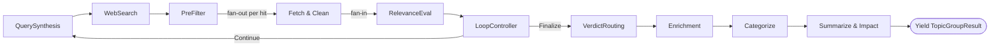

# MAF executor design: single-executor pipeline vs. step-per-executor graph

**Status:** Discussion / proposal — no code change yet.
**Audience:** Team review.
**Scope:** How we orchestrate one topic group's agentic RAG loop on Microsoft Agent Framework (MAF), and whether to keep the current "pipeline inside one executor" shape or move to the more idiomatic "graph of executors connected by edges."

---

## 1. What we have today

One topic group runs as a **single MAF executor** that self-loops:

- `TopicGroupLoopExecutor : Executor<PassSignal>` is the only node in the workflow graph.
- The graph has exactly one edge: a **self-edge** that carries `PassSignal.Continue` to drive the next loop pass. (`TopicGroupWorkflow.Build`.)
- All ten agents/steps run as plain, sequential `await` calls **inside** `TopicGroupPipeline.RunPassAsync` / `FinalizeAsync` — MAF never sees them as nodes.

```
RunPassAsync (one pass):
  1. QuerySynthesis  (LLM)     → one query
  2. WebSearch       (Bing)    → hits
  3. PreFilter       (code)    → dedupe / cross-group / URL validity
  4. Fetch & Clean   (HTTP)    → loop: one fetch per hit   ← sequential foreach
  5. RelevanceEval   (LLM)     → per-item verdicts
  6. LoopController  (code/LLM)→ retry or finalize

FinalizeAsync (once, on exit):
  VerdictRouting → Enrichment → Categorize → Summarize&Impact   (per carried item)
```

The executor is intentionally a **thin adapter** over `TopicGroupPipeline`. This was a deliberate choice: the loop is unit-testable as plain C# without standing up a workflow.

### How this maps to MAF's execution model

MAF runs in **super-steps**. For our single self-looping executor:

> **1 super-step = 1 invocation of `HandleAsync` = 1 full pass.**

At the end of each super-step, MAF takes a checkpoint. Our executor contributes its in-memory `SearchHistory` to that checkpoint via `OnCheckpointingAsync` (serialized as JSON under the `"SearchHistory"` state key), and restores it on resume via `OnCheckpointRestoredAsync`. The checkpoint is persisted to Cosmos through `CosmosCheckpointStore`.

---

## 2. The other pattern: a graph of executors

The canonical MAF shape decomposes each step into its **own** `Executor`, wired together with `AddEdge(...)`. Typed messages flow along edges (query → hits → filtered → documents → decision). The agentic loop becomes a **cyclic graph** with a **conditional edge** out of the loop controller:



Here the loop-back ("re-synthesize on the next pass") is just an **edge** from `LoopController` back to `QuerySynthesis`, instead of a `PassSignal.Continue` self-message wrapping an internal pipeline.

Both patterns are fully supported and idiomatic in MAF. Decomposition is **not** required.

---

## 3. Checkpointing — the core of the question

**Question raised:** *"Right now it saves a loop pass and resumes from there — so if it goes through one full pass (query synth → Bing → save docs → eval) and then it failed, it would not repeat that pass but pick up on the next pass?"*

**Answer: partly — and the caveat is the whole point.**

The checkpoint boundary is the **completed pass**, not the steps within it. So the behavior depends on *when* the failure happens:

| Failure timing | What happens on resume |
| --- | --- |
| Pass **N completes** (super-step ends, checkpoint written), then failure occurs while starting/processing pass **N+1** | Resume restores the post-pass-N checkpoint and **re-runs pass N+1 from the top**. Pass N is **not** repeated. ✅ This is the case you described. |
| Failure happens **mid-pass N** (e.g., Bing times out at step 2, or the LLM errors during eval at step 5) | The super-step never completed, so **no checkpoint for pass N was written**. Resume replays **all of pass N from step 1** — re-running query synthesis, Bing, *all* the fetches, and eval that already succeeded earlier in that same pass. ❌ |

So: **you can resume between passes, but you cannot resume within a pass.** Because most real failures (network timeouts, throttling, transient LLM errors) happen *during* a pass — often at the most expensive step (Fetch & Clean or RelevanceEval) — the practical effect is that a failure usually costs you the **entire** pass's LLM + Bing + HTTP work, not just the failed step.

### What step-per-executor checkpointing would give us

If each step were its own executor, MAF would checkpoint at **each step boundary** (each step is its own super-step). Then:

- A failure during RelevanceEval would resume **after** Fetch & Clean, replaying only the eval — **not** re-paying for the query, the Bing call, and all the document fetches.
- This is the single strongest argument for decomposing: **mid-pass resumability** on an expensive, network-bound agentic loop.

> Net: today's design = "checkpoint per pass." Decomposed graph = "checkpoint per step." For a loop that makes multiple paid LLM/Bing/HTTP calls per pass, per-step is materially more resilient and cheaper to recover.

---

## 4. Other benefits of the graph approach

Beyond checkpointing:

- **Fan-out / fan-in concurrency.** The Fetch & Clean step is currently a sequential `foreach (var hit in filtered) await _fetchAndClean.FetchAsync(...)`. As executors, Fetch & Clean (and per-doc eval) become a **fan-out**: N documents processed concurrently, joined before the controller. This is a natural MAF strength we currently leave unused.
- **Per-step observability.** Each executor emits its own super-step events, so we get a real per-node trace (latency, retries, failures per step) instead of an opaque "pass." The workflow can also be visualized.
- **Per-step retry / policy.** Resilience policies (retry, backoff) can be attached per step, where they belong (e.g., retry Bing, but don't retry a deterministic filter).
- **Composability.** Steps become reusable nodes that can be rewired (e.g., swap the finalize chain) without touching the loop body.

---

## 5. Costs / why it isn't free

- **Shared mutable state → typed messages.** The pipeline leans on mutating `TopicGroupContext` / `SearchHistory` in place. The edge-based model wants **typed messages passed between executors**. We'd either thread those as messages (idiomatic, more refactor) or keep mutating shared `context` (works in-process, but forfeits much of the benefit and is less clean). This is the main cost.
- **Loses some test simplicity.** The current selling point — "unit-test the loop without a workflow" — partly goes away; more behavior would be tested through MAF.
- **More boilerplate + more checkpoint state keys** to serialize between steps.
- **Loop-back + shared per-pass state** (e.g., the `LoopPass` being appended and then enriched within a pass) needs careful modeling so cross-step state survives edges and checkpoints.

---

## 6. Recommendation

- **It is not wrong to ship what we have.** It's the legitimate "code orchestration" pattern: simpler, well-documented, unit-testable. Fine for the POC and the current phase.
- **If we want mid-pass resume, parallel fetch/eval, and per-step telemetry**, decompose the pass into per-step executors with a conditional loop-back edge from `LoopController`. That matches the canonical MAF design and our original intuition.
- **Timing:** This is a meaningful refactor (mostly the shared-`context` → typed-message change), so it should **not** be folded into the current PR. It's a clean candidate for its own epic, and it **pairs naturally with parallel fan-out (Epic 12)** — the same decomposition that parallelizes topic groups also parallelizes fetch/eval *within* a group.

### Suggested decision

1. Ship the current single-executor design for this phase.
2. Open an epic: *"Decompose topic-group pass into per-step executors (mid-pass checkpointing + fan-out)."*
3. Sequence it with / before Epic 12 (parallel fan-out), since they share the decomposition work.

---

## 7. Sketch of the target (for discussion only)

Rough executor shapes (names illustrative):

```csharp
// Each step is its own executor; messages are the typed payloads between steps.
sealed class QuerySynthesisExecutor   : Executor<PassStart, QueryReady> { /* LLM */ }
sealed class WebSearchExecutor        : Executor<QueryReady, HitsReady> { /* Bing */ }
sealed class PreFilterExecutor        : Executor<HitsReady, FilteredHits> { /* code */ }
sealed class FetchAndCleanExecutor    : Executor<FilteredHits, DocumentsReady> { /* fan-out per hit */ }
sealed class RelevanceEvalExecutor    : Executor<DocumentsReady, EvalDone> { /* LLM */ }
sealed class LoopControllerExecutor   : Executor<EvalDone> { /* routes Continue | Finalize */ }
// finalize chain: VerdictRouting → Enrichment → Categorize → Summarize&Impact → yield result
```

```csharp
var builder = new WorkflowBuilder(querySynthesis)
    .AddEdge(querySynthesis, webSearch)
    .AddEdge(webSearch, preFilter)
    .AddEdge(preFilter, fetchAndClean)     // fan-out happens inside / via per-item activations
    .AddEdge(fetchAndClean, relevanceEval) // fan-in before eval
    .AddEdge(relevanceEval, loopController)
    .AddEdge(loopController, querySynthesis, condition: d => d.Continue)  // loop-back edge
    .AddEdge(loopController, verdictRouting, condition: d => d.Finalize)  // exit edge
    .AddEdge(verdictRouting, enrichment)
    .AddEdge(enrichment, categorize)
    .AddEdge(categorize, summarize)
    .WithOutputFrom(summarize);
```

`SearchHistory` would still be checkpointed, but per-step intermediate payloads (hits, filtered, documents) would also be checkpointable, enabling resume between steps.

> This section is a thinking aid, not a committed API. Exact MAF signatures, fan-out mechanics, and conditional-edge syntax should be validated against MAF 1.10 before implementation.
