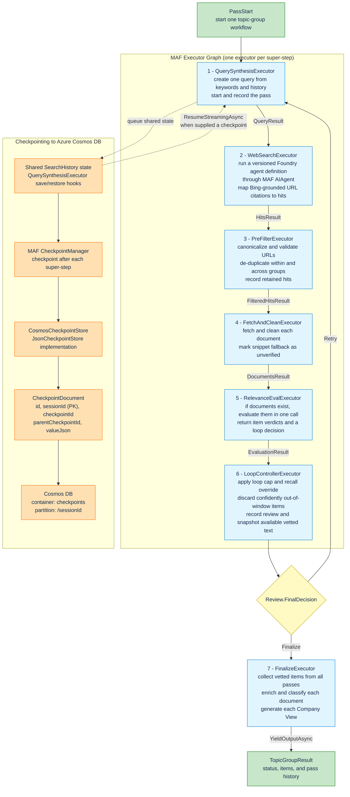

# MAF Topic-Group Workflow

`TopicGroupWorkflow` runs one checkpointed MAF workflow per topic group.

## Notes

- **Execution**: `ScanOrchestrator` runs topic-group workflows concurrently, limited by `MaxParallelTopicGroups`. Each workflow processes its executors sequentially.
- **Web search**: the provisioning CLI creates a versioned `DeclarativeAgentDefinition` containing the Foundry model deployment and server-side Grounding with Bing Custom Search tool. Runtime resolves the definition and adapts it to MAF with `AIProjectClient.AsAIAgent(...)`; `WebSearchAgent` streams the run and maps citations to hits. This is not a Foundry Hosted Agent workload.
- **Loop policy**: relevance evaluation supplies `Retry` or `Finalize`. The controller always finalizes at `MaxLoops`; below the cap, it changes `Finalize` to `Retry` when at least 80% of verdicts are `Relevant`.
- **Finalization**: the controller records vetted and discarded items per pass. `FinalizeExecutor` collects vetted items across all passes, reads available Blob snapshots, enriches each item, assigns per-document impact area and tags, generates per-document Company Views, and yields the result with pass history.
- **Checkpointing**: production persists a checkpoint after each super-step. `QuerySynthesisExecutor` alone queues the shared `SearchHistory`; `CosmosCheckpointStore` upserts each checkpoint under its `sessionId`. The workflow can restore an empty history through `ResumeStreamingAsync`, but the production executor currently always starts with `RunStreamingAsync` and does not select a stored checkpoint.
